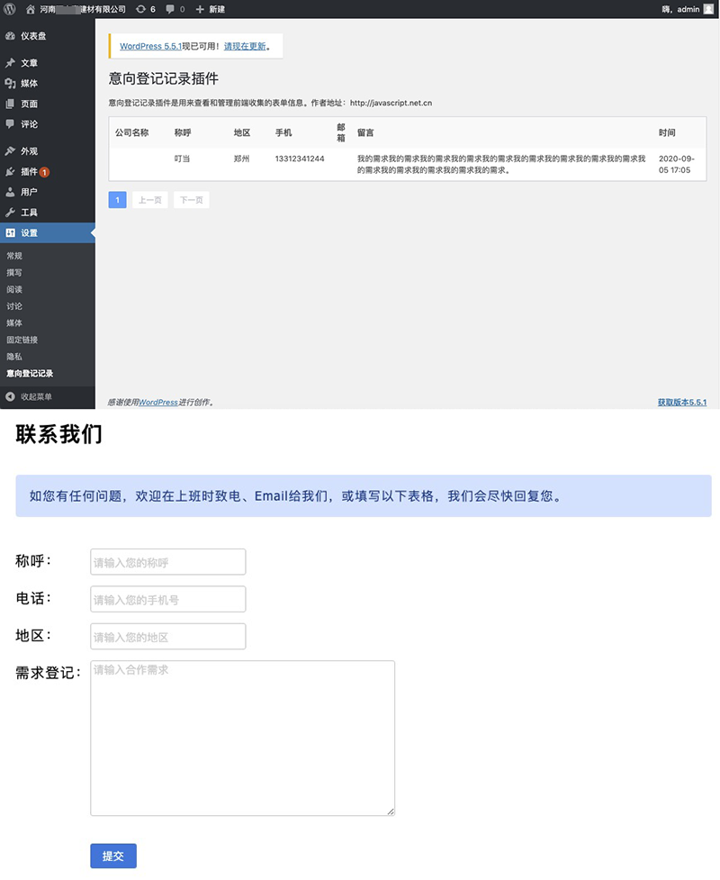

### BasicForm 基础表单插件

一个 WordPress 基础表单插件，可在网站控制面板管理网站

### 演示站点
- http://javascript.net.cn

### 使用方法
使用方法参考 ./example.html 文件
用户表单样式可以使用 ./assets/css/_form.scss

### 贡献者
 - Author: ngtwewy <62006464@qq.com>
 - Author URI: http://javascript.net.cn
 - Project URI: https://github.com/ngtwewy/basicform
 - License: Apache Licence 2.0
 - License URI: http://www.apache.org/licenses/LICENSE-2.0
